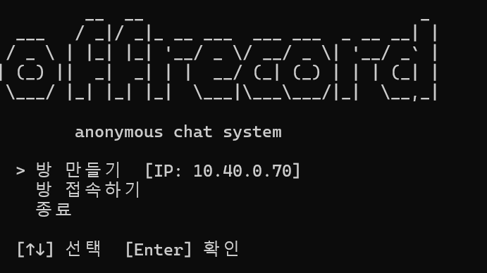
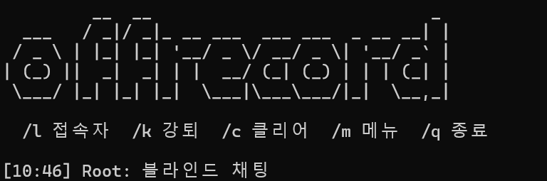

# offrecord

P2P 익명 채팅 시스템. 블라인드 테스트용으로 설계되어 누가 호스트인지, 누가 어떤 메시지를 보냈는지 구분하기 어렵게 만들어졌습니다.

## 특징

- 서버/클라이언트 구조의 P2P 채팅
- 블라인드 모드: 호스트 구분 없음
- 시간 기반 메시지 표시
- 단축키 지원

## 스크린샷

### 메인 메뉴


### 채팅 화면


## 요구사항

- Go 1.21 이상

## Go 설치

### Windows

1. [Go 공식 사이트](https://go.dev/dl/)에서 Windows 설치 파일 다운로드
2. 설치 파일 실행 후 안내에 따라 설치
3. 터미널에서 설치 확인:
   ```
   go version
   ```

### macOS

```bash
brew install go
```

### Linux

```bash
# Ubuntu/Debian
sudo apt install golang-go

# 또는 공식 사이트에서 다운로드
wget https://go.dev/dl/go1.21.0.linux-amd64.tar.gz
sudo tar -C /usr/local -xzf go1.21.0.linux-amd64.tar.gz
export PATH=$PATH:/usr/local/go/bin
```

## 빌드

```bash
cd offrecord
go mod tidy
go build -o offrecord.exe
```

또는 Windows에서:

```
build.bat
```

## 실행

```
./offrecord.exe
```

## 사용법

### 메인 메뉴

```
  > 방 만들기  [IP: xxx.xxx.xxx.xxx]
    방 접속하기
    종료
```

- `↑↓` 방향키로 선택
- `Enter`로 확인
- `Esc`로 종료

### 방 만들기 (호스트)

1. 닉네임 입력
2. 포트 번호 입력 (기본값: 9000)
3. 채팅 시작

### 방 접속하기 (클라이언트)

1. 닉네임 입력
2. 호스트 IP:포트 입력 (예: `192.168.0.10:9000`)
3. 채팅 시작

### 채팅 명령어

| 명령어 | 단축키 | 설명 |
|--------|--------|------|
| /list | /l | 접속자 목록 |
| /kick | /k | 강제 퇴장 (호스트만) |
| /clear | /c | 화면 클리어 |
| /menu | /m | 메인 메뉴로 |
| /quit | /q | 프로그램 종료 |

## 라이선스

MIT
