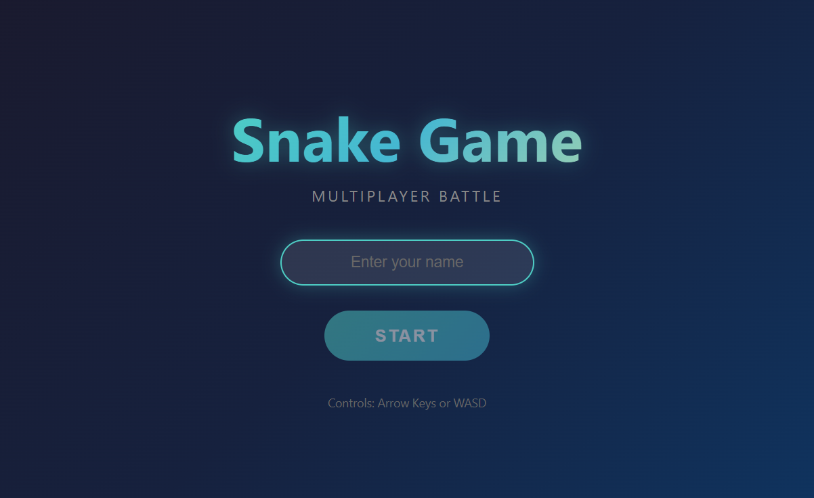
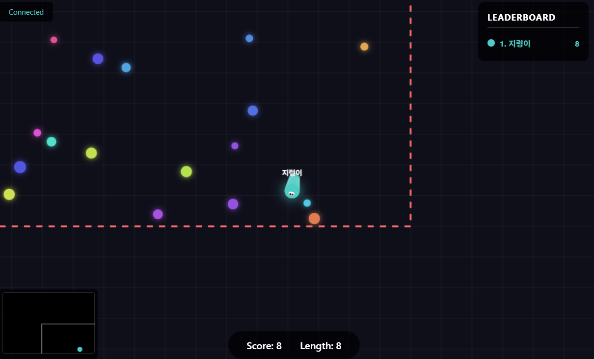

# Multiplayer Snake Game

실시간 멀티플레이어 스네이크 게임입니다. 여러 플레이어가 동시에 접속하여 같은 맵에서 경쟁할 수 있습니다.

## 게임 스크린샷

### 시작 화면


### 게임 플레이


## 주요 기능

| 기능 | 설명 |
|------|------|
| 멀티플레이어 | 여러 명이 동시에 같은 맵에서 플레이 |
| 실시간 동기화 | Socket.io 기반 30fps 상태 동기화 |
| 부드러운 움직임 | 클라이언트 보간 처리 (60fps 렌더링) |
| 닉네임 시스템 | 게임 시작 전 닉네임 입력 |
| 리더보드 | 실시간 점수 순위 표시 |
| 미니맵 | 전체 맵과 플레이어 위치 표시 |
| 충돌 시스템 | 다른 뱀과 충돌 시 사망, 먹이로 변환 |
| XSS 방지 | 다중 레이어 보안 처리 |

## 게임 규칙

1. **이동**: 키보드 방향키 또는 WASD로 뱀의 방향을 조절합니다
2. **먹이**: 맵에 있는 컬러 원을 먹으면 점수를 얻고 길이가 늘어납니다
3. **충돌**: 다른 뱀의 몸통에 부딪히면 사망합니다
4. **사망 시**: 뱀이 먹이로 변환되어 다른 플레이어가 먹을 수 있습니다
5. **리스폰**: 사망 후 "Play Again" 버튼으로 다시 시작할 수 있습니다

## 조작법

| 키 | 동작 |
|---|------|
| `↑` 또는 `W` | 위로 이동 |
| `↓` 또는 `S` | 아래로 이동 |
| `←` 또는 `A` | 왼쪽으로 이동 |
| `→` 또는 `D` | 오른쪽으로 이동 |

---

## 설치 및 실행 방법

### 1. Node.js 설치 (필수)

이 게임을 실행하려면 **Node.js**가 필요합니다.

#### Windows
1. [Node.js 공식 사이트](https://nodejs.org/) 접속
2. **LTS 버전** (권장) 다운로드
3. 설치 파일 실행 후 기본 설정으로 설치
4. 설치 확인:
   ```bash
   node --version
   npm --version
   ```

#### macOS
```bash
# Homebrew 사용
brew install node

# 또는 공식 사이트에서 다운로드
```

#### Linux (Ubuntu/Debian)
```bash
curl -fsSL https://deb.nodesource.com/setup_lts.x | sudo -E bash -
sudo apt-get install -y nodejs
```

### 2. 의존성 설치

프로젝트 폴더에서 다음 명령어 실행:

```bash
cd snake-game
npm install
```

### 3. 서버 실행

#### 방법 1: 배치 파일 실행 (Windows - 권장)
`start-server.bat` 파일을 더블클릭하면 서버가 실행됩니다.
창을 닫으면 서버가 종료됩니다.

#### 방법 2: 명령어 실행
```bash
npm start
```

#### 방법 3: 개발 모드 (자동 재시작)
```bash
npm run dev
```

### 4. 게임 접속

서버 실행 후 브라우저에서 접속:
```
http://localhost:3000
```

여러 브라우저 탭이나 다른 기기에서 동시 접속하면 멀티플레이 가능합니다.

---

## 프로젝트 구조

```
snake-game/
├── server/
│   ├── index.js          # Express + Socket.io 서버
│   └── game.js           # 서버 측 게임 로직
├── public/
│   ├── index.html        # 메인 HTML
│   ├── css/
│   │   └── style.css     # 스타일시트
│   └── js/
│       └── game.js       # 클라이언트 게임 로직
├── start-server.bat      # Windows 서버 실행 파일
├── package.json          # 프로젝트 설정
└── README.md             # 이 파일
```

---

## 기술 스택

| 구분 | 기술 |
|------|------|
| 프론트엔드 | HTML5 Canvas, Vanilla JavaScript |
| 백엔드 | Node.js, Express |
| 실시간 통신 | Socket.io |
| 렌더링 | 60fps Canvas 렌더링 + 보간 처리 |

---

## 보안 적용 사항

### XSS (Cross-Site Scripting) 방지

3중 방어 체계를 적용했습니다:

| 레이어 | 위치 | 처리 내용 |
|--------|------|----------|
| 1차 | 클라이언트 입력 | `<>\"'&\/\` 특수문자 제거, `script` 문자열 필터링 |
| 2차 | 서버 처리 | 동일 필터링 + `javascript:`, `onclick=` 등 이벤트 핸들러 제거 |
| 3차 | 클라이언트 출력 | `innerHTML` 대신 `createElement` + `textContent` 사용 |

### 차단되는 공격 예시
- `<script>alert(1)</script>` → "Player"
- `` → "img onerroralert1"
- `javascript:alert(1)` → "alert1"

---

## 서버 설정

### 환경 변수

| 변수 | 기본값 | 설명 |
|------|--------|------|
| `PORT` | 3000 | 서버 포트 번호 |

```bash
# 다른 포트로 실행
PORT=8080 npm start
```

### 게임 설정 (server/game.js)

```javascript
this.config = {
  width: 1200,      // 맵 가로 크기
  height: 800,      // 맵 세로 크기
  gridSize: 10,     // 그리드 크기
  initialLength: 5, // 초기 뱀 길이
  foodCount: 50,    // 맵의 먹이 개수
  speed: 3          // 이동 속도 (픽셀/프레임)
};
```

---

## 라이선스

MIT License

---

## 문제 해결

### 포트가 이미 사용 중인 경우

Windows:
```bash
netstat -ano | findstr :3000
taskkill /F /PID [PID번호]
```

macOS/Linux:
```bash
lsof -i :3000
kill -9 [PID번호]
```

### node_modules 문제

```bash
rm -rf node_modules
npm install
```
